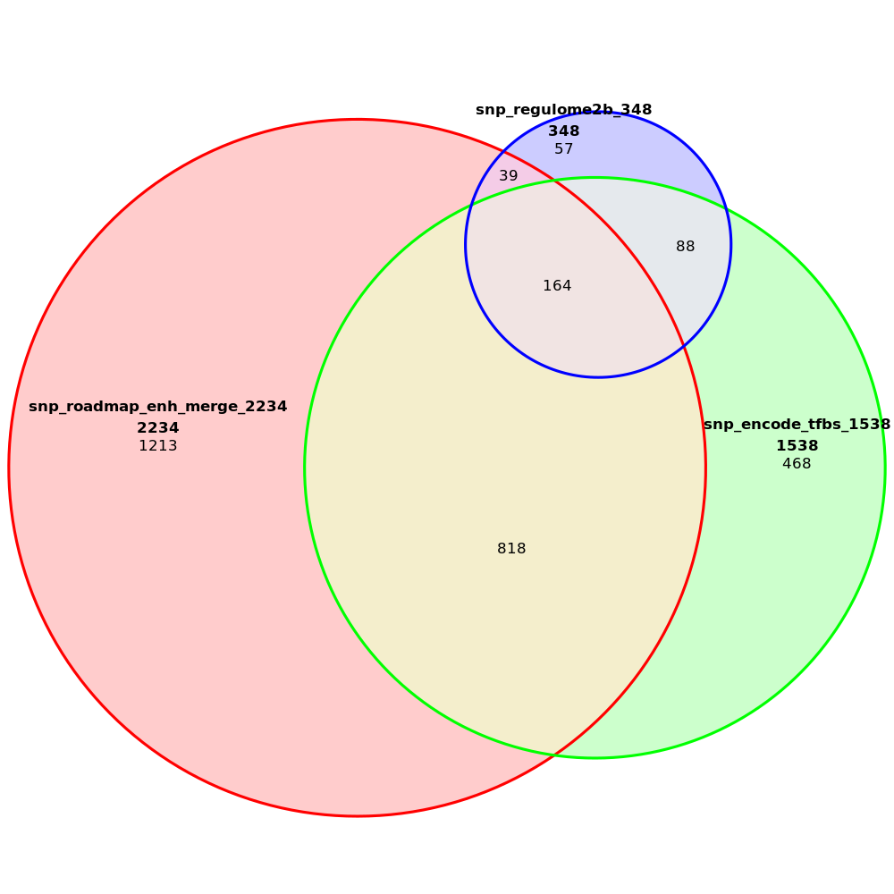
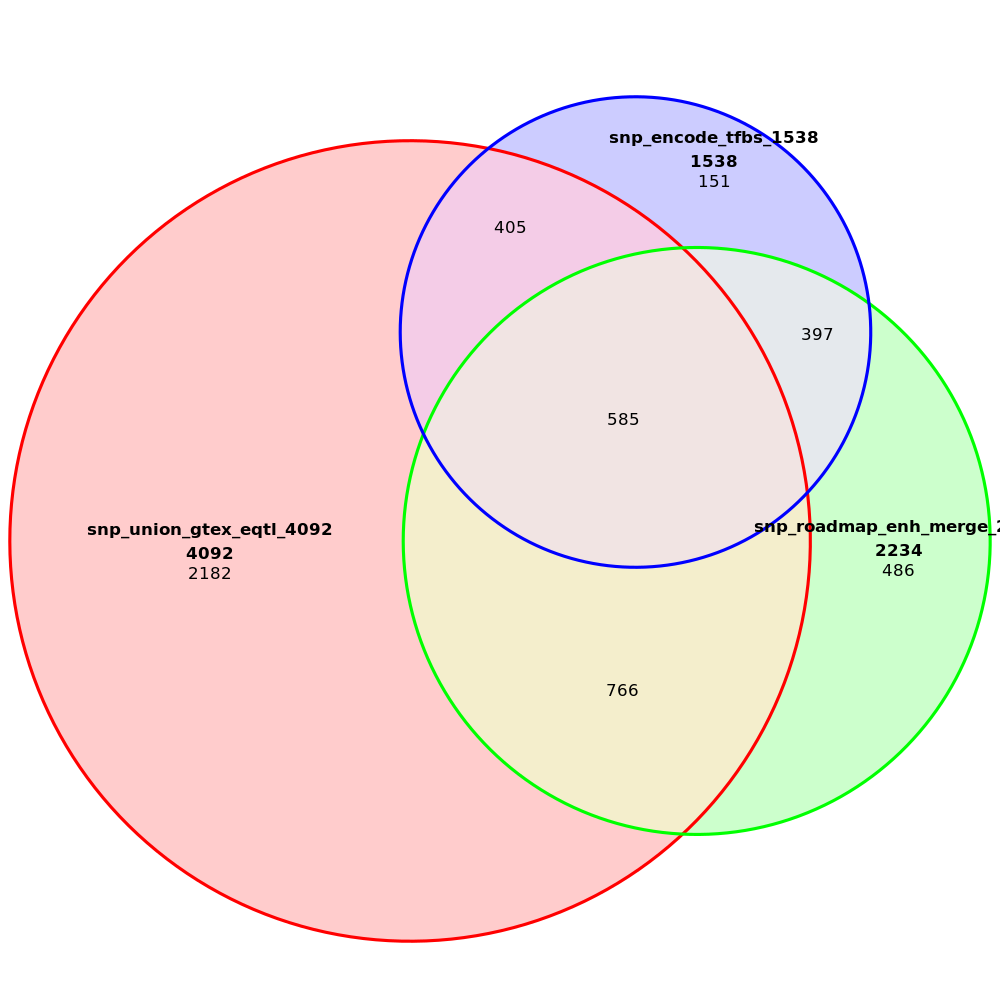
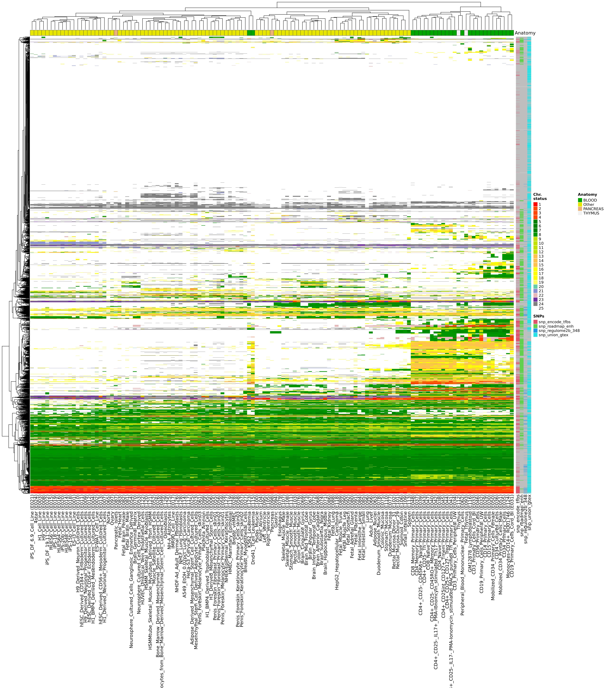
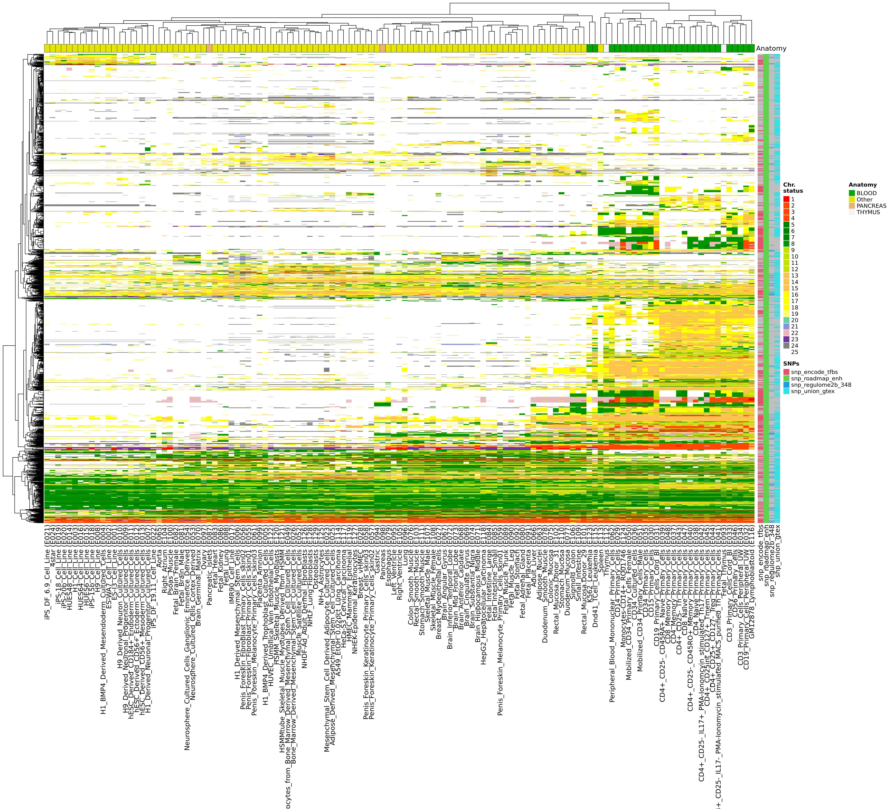
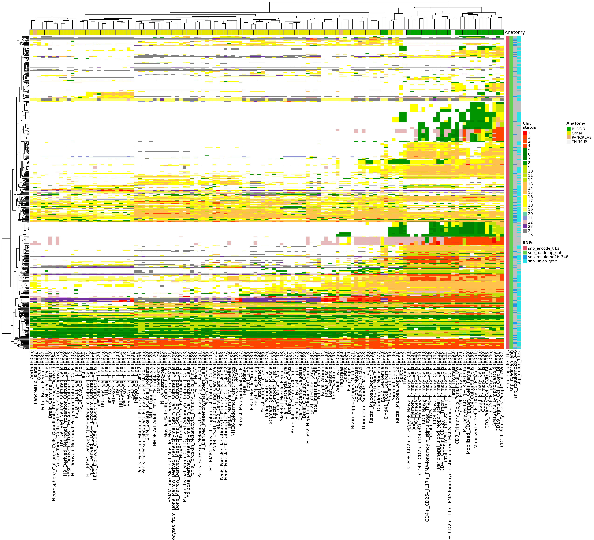
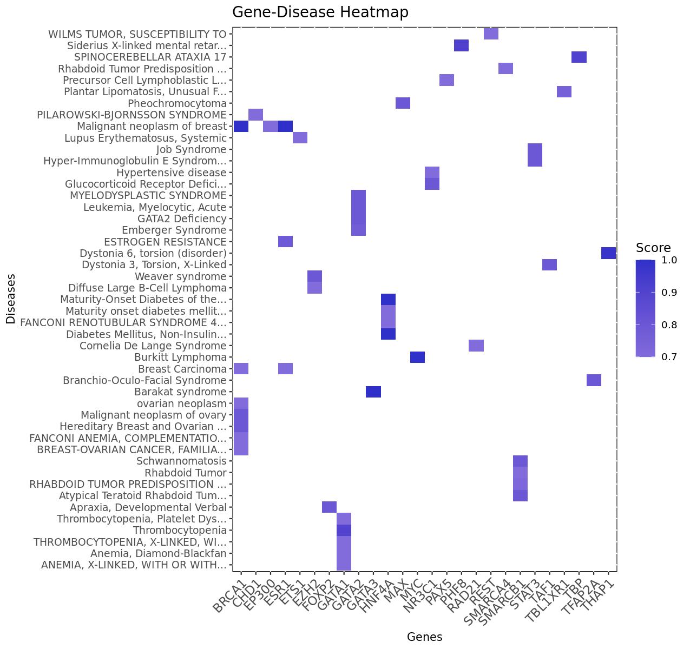
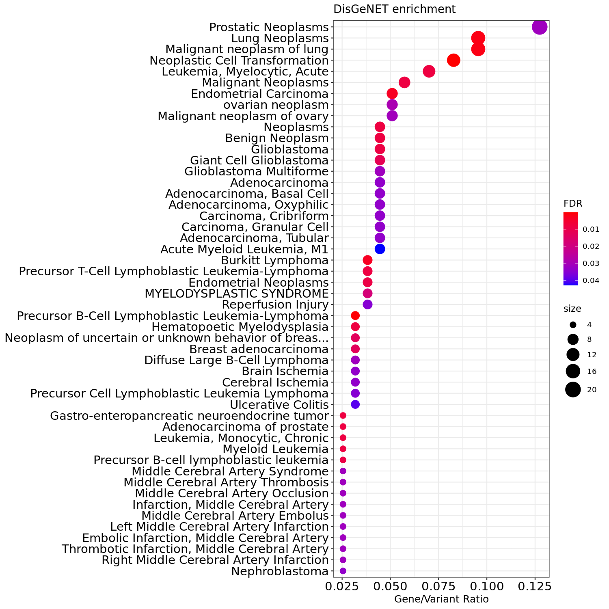

# I. Prioritization of type 1 diabetes risk SNPs

This is an analysis pipeline for prioritization of SNPs associated with type 1 diabetes (T1D) by using our [postgwas-tools (Feb 2020 version)](https://github.com/kisudsoe/PostGWAS-tools/wiki). You can follow the below analysis pipeline.


## 1. Preparing T1D candidate SNPs

To download manually curated GWAS SNPs from the NHGRI-EBI GWAS Catalog[^MacArthur et al, 2017], you can search from their homepage, https://www.ebi.ac.uk/gwas/. Here we downloaded T1D associated risk SNPs ([EFO0001359](https://www.ebi.ac.uk/gwas/efotraits/EFO_0001359)). Then you can generate basic summary tables of SNPs, genes, and studies for this phenotype (i.e., T1D) by the `--gwas` function.

**Generating pivot tables**

```bash
Rscript postgwas-exe.r \
	--gwas trait gene study \
	--base db/gwas/EFO0001359_2020-02-19.tsv \
	--out db/gwas
```

> ** Run function trait_pivot:
> Write TRAITS pivot: db/EFO0001359_2020-02-19_snps.tsv
>
> ** Run function gene_pivot:
> Write gene pivot: db/EFO0001359_2020-02-19_genes.tsv
>
> ** Run function study_pivot:
> Write study pivot: db/EFO0001359_2020-02-19_studies.tsv
> Job done for 0.6 sec

As the result, we found that 46 studies were compiled as the T1D (Todd JA et al., pmid 17554260; Wellcome Trust Case Control Consortium, pmid 17554300; Hakonarson H et al., pmid17632545; Hakonarson H et al., pmid 18198356; Grant SF et al., pmid 18840781; Cooper JD et al., pmid 18978792; Barrett JC et al., pmid 19430480; Wallace C et al., pmid 19966805; Plagnol V et al., pmid 21829393; Bradfield JP et al., pmid 21980299; Huang J et al., pmid 22293688; Onengut-Gumuscu S et al., pmid 25751624; Kawabata Y et al., pmid 30552108; Zhu M et al., pmid 31152121) as well as various co-occurred phenotypes including, various autoantibody levels (Plagnol V et al., pmid 21829393), erectile dysfunction (Hotaling JM et al., pmid 22704111), end-stage renal disease and urinary albumin excretion rate (Sandholm N et al., pmid 24595857), diabetic nephropathy (Germain M et al., pmid 25476525), autoimmune thyroid diseases (Tomer Y et al., pmid 25936594), pediatric autoimmune diseases (Li YR et al., 26301688), skin fluorescence (Roshandel D et al., pmid 27207532), foot ulcer and neuropathy (Meng W et al., pmid 28672053), time to event of T1D (Sharma A et al., pmid 29310926), C-peptide levels (Roshandel D et al., pmid 29404672), coronary artery disease (Charmet R et al., pmid 29695241), Latent autoimmune diabetes (Cousminer DL et al., pmid 30254083), glycated hemoglobin levels (Syreeni A et al., pmid 30674623), and various types of kidney diseases (Salem RM et al., pmid 31537649) (see details in `db/EFO0001359_2020-02-19_studies.tsv`).

To identify significant risk SNPs, SNPs were filtered by their phenotype association *P*-values <`5e-8` by the `--gwas` function.

**Filtering the T1D risk SNPs**

```bash
Rscript postgwas-exe.r \
	--gwas filter \
	--base db/gwas/EFO0001359_2020-02-19.tsv \
	--out db/gwas \
	--p.criteria 5e-8
```

> ** Run function gwas_filt:
>   gwas dim = [1] 330  38    
>   gwas (5e-08) = [1] 192  38
> Write gwas filter: db/gwas_5e-08_152.tsv
> Job done for 0 sec 

As the result, we identified 152 sentinel SNPs (*p*<5e-8). Then SNPs were annotated with corresponding 1000 genome populations from their discovered populations `db/gwas/EFO0001359_2020-02-19_studies.tsv` at additional <Pops> column and file names at <File> column, for example at `data/gwas_5e-08_152_pops.tsv`:

```txt
<Rsid>      <Pops>   	<File>					<...>
rs9273368	EUR			rs9273368 EUR.txt		...
rs1983890	EUR			rs1983890 EUR.txt		...
rs9273368	EUR			rs9273368 EUR.txt		...
rs689		EUR CHB CHS	rs689 EUR CHB CHS.txt	...
```

To achieve the SNPs in LD with a sentinel which called as proxy SNPs, we queried the 152 sentinel SNPs to the LDlink DB Version 5.0 (Feb. 2021)[^Machiela et al, 2015] by using `--ldlink` function.

* `data/gwas_5e-08_152_pops.tsv` -> **Supplementary Table 1**

**Downloading LD linked SNPs**

```bash
Rscript postgwas-exe.r \
	--ldlink down \
	--base data/gwas_5e-08_152_pops.tsv \
	--out data/ldlink
```

> ** Run function ldlink_down... ready
> Rsid query = 152..
> File saved to rs9273368 EUR.txt.
> File saved to rs1983890 EUR.txt.
> File saved to rs689 EUR CHB CHS.txt.
> File saved to rs2476601 EUR.txt.
> File saved to rs3184504 EUR.txt.
> File saved to rs61839660 EUR.txt.
> File saved to rs1265564 EUR.txt.
> File saved to rs2304256 EUR.txt.
> File saved to rs941576 EUR.txt.  10/152 query..
> File saved to rs17696736 EUR.txt. 10 files are moved.
>
> ...
> error: rs75793288 is not in 1000G reference panel.,
> mv: cannot stat '*.txt': No such file or directory
>
> error: rs117372389 is monoallelic in the CHB+CHS population.,
> mv: cannot stat '*.txt': No such file or directory
>
> ...
>
> File saved to rs1689510 EUR.txt.
> File saved to rs11171739 EUR.txt.
> Process done. Please check your out folder: data/ldlink
> Job done: 2021-02-03 02:32:33 for 32.6 min

As the result, out of the 152 SNPs, 150 SNPs were downloaded. Then, the downloaded SNPs were filtered by the criteria r<sup>2</sup> >0.6. 

**Filtering the LDlink data**

* `--blk_idx TRUE`: If TRUE, add LD blocks following by the criteria.
* `--srch_bio TRUE`: If TRUE, query Rsids to Ensembl biomaRt to find their coordinates.
* `--hg hg19`: Select between hg19/hg38 for Ensembl biomaRt search.

```bash
Rscript postgwas-exe.r \
  --ldlink filter \
  --base data/gwas_5e-08_152_pops.tsv \
  --ldpath data/ldlink \
  --out data/input_bed \
  --r2 0.6 \
  --blk_idx TRUE \
  --srch_bio TRUE \
  --hg hg19
```

> ** Run function ldlink_filter...
> Read download files... 152
> Error in file(file, "rt") : cannot open the connection
> In addition: Warning message:
> In file(file, "rt") :
>   cannot open file 'data/ldlink/rs75793288 EUR.txt': No such file or directory
>   [ERROR] rs75793288
> Error in file(file, "rt") : cannot open the connection
> In addition: Warning message:
> In file(file, "rt") :
>   cannot open file 'data/ldlink/rs117372389 EUR.txt': No such file or directory
>   [ERROR] rs117372389
>   Read LDlink results           = [1] 302172     11
>     Filtering by "r2 > 0.6": [1] 7632   11
>     [Message] No filter criteria for Dprime.
>   Filtered data dimension       = [1] 7632    3
>   Excluded no rsid elements     = [1] 118
>
> Basic summary of LDlink results:
>   SNP Tier 1                    = 152
>   SNP Tier 2                    = 5740
>   SNP candidates                = 5892
>   SNP source annotation table   = [1] 5892    2
>
> Add annotations:
>   Calculate LD block index -> group1 -> group2 = [1] 118
>
> Search biomart for SNP coordinates:
>   Query SNPs            = [1] 5892
>   Hg19 result table     = [1] 5887    4
>   Merge data            = [1] 5893    7
> Cytoband annotation... 5893.. done
>   Merged table          = [1] 5893    8
>
> Write file: data/input_bed/gwas_biomart_5892.tsv
> Job done: 2021-02-03 04:07:57 for 24.2 sec

As the result, we found 5740 proxy SNPs (r<sup>2</sup> >0.6) from the 152 T1D sentinel SNPs. In total, we defined 5,892 SNPs as T1D candidate SNPs.

To prepare the input BED file (hg19), we need to check and fill the `NA` values at the SNP coordinates by manually for sure.

* `data/input_bed/gwas_biomart_5892.tsv` -> `data/input_bed/gwas_biomart_5892_uq.tsv`: changed file name.
* `data/input_bed/gwas_biomart_5892_uq.tsv` -> **Supplementary Table 1**

**Prepare input BED file (hg19)**

```bash
Rscript postgwas-exe.r \
  --ldlink  bed \
  --base data/input_bed/gwas_biomart_5892_uq.tsv \
  --out data/input_bed
```

> ** Run function ldlink_bed...
> Read, data/input_bed/gwas_biomart_5892_uq.tsv = [1] 5892    8
> Write file:     data/input_bed/gwas_biomart_5892.bed
> Job done: 2021-02-03 04:22:58 for 2.5 sec


## 2. Functional annotations & summary

To annotate functional evidences such as enhancer, TFBS, regulatory elements, eQTL, and lncRNAs, we downloaded `db_gwas.zip` file from our google drive share point.

* [db_gwas.zip](https://drive.google.com/file/d/1D6CVKi7-83a-g6Gd8X0UhVrYHCcph-wl/view?usp=sharing): a prepared database files. See details at [db_gwas](https://github.com/kisudsoe/PostGWAS-tools/wiki/db_gwas).
* Uncompress and place the db files into the `db` folder. 

To run the annotation process, `ann-analysis.sh` file was set up as below:

```bash
WORK_DIR="data"
BASE_BED=$WORK_DIR"/input_bed/gwas_biomart_5892.bed"
SH_FILE="dist_data.sh"
ANN_PATH="db"

ROAD_FILE=$ANN_PATH"/roadmap_meta.tsv"
REG_DIR=$ANN_PATH"/regulome"
```

The `ann-analysis.sh` file was run to get union lists:

```bash
bash ann-analysis.sh
```

> 1. Overlapping the functional annotations
> 1-1. Measuring distance by bedtools..
>
> ** Run function: utils.r/bash_script... Ready
> Write bash file: dist_data.sh
> Job done: 2021-02-03 19:55:50 for 0.1 sec
>
>   Run bedtools commands. This process takes a while.. 
>   1) Genome_dist.. done
>   2) Roadmap_dist.. done
>   3) Roadmap_dist_25.. done
> done
> 1-2. UCSC gene tags separation.. done
> 1-3. Roadmap merge & cell type.. 1/3 2/3 3/3 done
> 1-4. RegulomeDB.. done
> 1-5. lncRNASNP2.. done
> 1-6. GTEx eQTL genes.. done
>
> 2. Union list to summary
> 2-1. ENCODE Tfbs.. done
> 2-2. Roadmap Enhancers.. 1/2
> [Message] Can't plot Venn diagram for more than 5 sets.
>
> [Message] Can't plot Euler plot.
> 2/2 done
> 2-3. GTEx eQTLs union
> [Message] Can't plot Venn diagram for more than 5 sets.
>
> [Message] Can't plot Euler plot.
> done

To generate summary tables, `summ-analysis.sh` was set up as follow. 

```bash
WORK_DIR="data"
ANN_GWAS=$WORK_DIR"/input_bed/gwas_biomart_5892_uq.tsv"
ANN_GTEX=$WORK_DIR"/gtex_signif_3938.tsv"
```

The `summ-analysis.sh` file was run to get summary tables:

```bash
bash summ-analysis.sh
```

> Summary table.. 
> [Message] Can't plot Venn diagram for more than 5 sets.
>
> [Message] Can't plot Euler plot.
> done


## 3. Venn analysis

To identify high-probability SNPs (overlap-1), below command was run.

```bash
Rscript src/venn_analysis.r --fig \
  --base data/summary/snp_roadmap_enh_merge_2234.bed data/summary/snp_encode_tfbs_1538.bed data/summary/snp_regulome2b_348.bed \
  --out  fig
```

>       original   fitted residuals regionError
> A         1213 1213.275    -0.275       0.004
> B          468  468.975    -0.975       0.002
> C           57   63.401    -6.401       0.002
> A&B        818  817.050     0.950       0.002
> A&C         39   10.623    28.377       0.010
> B&C         88   79.529     8.471       0.003
> A&B&C      164  167.319    -3.319       0.002
>
> diagError: 0.01
> stress:    0
>
> Euler fit is done.
>
> Figure draw: fig/venn_snp_roadmap_enh_merge_2234_snp_encode_tfbs_1538.png



To identify enhancer-tfbs eQTLs, below command was run.

```bash
Rscript src/venn_analysis.r --fig \
  --base data/gtex_eqtl/snp_union_gtex_eqtl_4092.bed data/summary/snp_roadmap_enh_merge_2234.bed data/summary/snp_encode_tfbs_1538.bed \
  --out  fig
```

>       original   fitted residuals regionError
> A         2182 2193.052   -11.052       0.024
> B          486  540.537   -54.537       0.016
> C          151  261.440  -110.440       0.025
> A&B        766  698.649    67.351       0.007
> A&C        405  249.754   155.246       0.029
> B&C        397  150.413   246.587       0.048
> A&B&C      585  647.284   -62.284       0.019
>
> diagError: 0.048
> stress:    0.017
>
> Euler fit is done.
>
> Figure draw: fig/venn_snp_union_gtex_eqtl_4092_snp_roadmap_enh_merge_2234.png



To identify overlaps between overlap-1, overlap-2, and lncRNAs, below command was run.

```bash
Rscript src/venn_analysis.r --fig \
  --base data/input_bed/overlap-1_164.bed data/input_bed/overlap-2_585.bed data/summary/snp_lncrnasnp_314.bed \
  --out  fig
```

>       original  fitted residuals regionError
> A           31  31.108    -0.108       0.000
> B          416 416.008    -0.008       0.001
> C          263 263.009    -0.009       0.000
> A&B        121 120.951     0.049       0.000
> A&C          3   1.558     1.442       0.002
> B&C         39  38.865     0.135       0.000
> A&B&C        9   9.441    -0.441       0.001
>
> diagError: 0.002
> stress:    0
>
> Euler fit is done.
>
> Figure draw: fig/venn_overlap-1_164_overlap-2_585.png


# II. Advanced analysis

## 1. Heatmap for chromatin status

To draw heatmap by using the Roadmap ChromHMM annotations, run below command function.

**5,892 T1D candidate SNPs**

```bash
Rscript src/roadmap_summary.r --heatmap \
    --f_roadmap_summ data/summary_roadmap.tsv \
    --f_meta db/roadmap_meta.tsv \
    --annot BLOOD,PANCREAS,THYMUS \
    --f_snps data/summary/snp_encode_tfbs_1538.bed,data/summary/snp_roadmap_enh_merge_2234.bed,data/summary/snp_regulome2b_348.bed,data/gtex_eqtl/snp_union_gtex_eqtl_4092.bed \
    --file_ext png \
    --out fig
```

> ** Run heatmap function in roadmap_summary.r **
>
> * Read file: data/summary_roadmap.tsv = [1] 5892  128
> * Meta-info table = [1] 127   9
>   Reordering -> extract ha1 -> extract ha2 -> done
>   Configuration for heatmap -> done
> * Read SNPs BED files  [....] Annotation merge -> done
> * Draw heatmap -> done
>
> Save as fig/roadmap_summ.png
>
> Job done: 2021-02-04 03:15:41 for 47.1 sec



**2,234 enhancer residing SNPs**

```bash
Rscript src/roadmap_summary.r --heatmap \
    --f_roadmap_summ data/summary_roadmap.tsv \
    --f_snp_filt data/summary/snp_roadmap_enh_merge_2234.bed \
    --f_meta db/roadmap_meta.tsv \
    --annot BLOOD,PANCREAS,THYMUS \
    --f_snps data/summary/snp_encode_tfbs_1538.bed,data/summary/snp_roadmap_enh_merge_2234.bed,data/summary/snp_regulome2b_348.bed,data/gtex_eqtl/snp_union_gtex_eqtl_4092.bed \
    --file_ext png \
    --out fig
```

> ** Run heatmap function in roadmap_summary.r **
>
> * Read file: data/summary_roadmap.tsv = [1] 5892  128
>   [Option] Filt SNPs by data/summary/snp_roadmap_enh_merge_2234.bed = [1] 2234  128
> * Meta-info table = [1] 127   9
>   Reordering -> extract ha1 -> extract ha2 -> done
>   Configuration for heatmap -> done
> * Read SNPs BED files  [....] Annotation merge -> [Option] Filt by 2234 snps -> done
> * Draw heatmap -> done
>
> Save as fig/roadmap_summ_snp_roadmap_enh_merge_2234.png
>
> Job done: 2021-02-04 03:26:22 for 16.4 sec



**982 enhancer & TFBS SNPs**

```bash
Rscript src/roadmap_summary.r --heatmap \
    --f_roadmap_summ data/summary_roadmap.tsv \
    --f_snp_filt data/input_bed/enh_tfbs_982.bed \
    --f_meta db/roadmap_meta.tsv \
    --annot BLOOD,PANCREAS,THYMUS \
    --f_snps data/summary/snp_encode_tfbs_1538.bed,data/summary/snp_roadmap_enh_merge_2234.bed,data/summary/snp_regulome2b_348.bed,data/gtex_eqtl/snp_union_gtex_eqtl_4092.bed \
    --file_ext png \
    --out fig
```

> ** Run heatmap function in roadmap_summary.r **
>
> * Read file: data/summary_roadmap.tsv = [1] 5892  128
>   [Option] Filt SNPs by data/input_bed/enh_tfbs_982.bed = [1] 982 128
> * Meta-info table = [1] 127   9
>   Reordering -> extract ha1 -> extract ha2 -> done
>   Configuration for heatmap -> done
> * Read SNPs BED files  [....] Annotation merge -> [Option] Filt by 982 snps -> done
> * Draw heatmap -> done
>
> Save as fig/roadmap_summ_enh_tfbs_982.png
>
> Job done: 2021-02-04 03:37:41 for 9.6 sec



**164 high-probability SNPs (overlap-1)**

```bash
Rscript src/roadmap_summary.r --heatmap \
    --f_roadmap_summ data/summary_roadmap.tsv \
    --f_snp_filt data/input_bed/overlap1_164.bed \
    --f_meta db/roadmap_meta.tsv \
    --annot BLOOD,PANCREAS,THYMUS \
    --f_snps data/summary/snp_encode_tfbs_1538.bed,data/summary/snp_roadmap_enh_merge_2234.bed,data/summary/snp_regulome2b_348.bed,data/gtex_eqtl/snp_union_gtex_eqtl_4092.bed \
    --file_ext png \
    --out fig
```

> ** Run heatmap function in roadmap_summary.r **
>
> * Read file: data/summary_roadmap.tsv = [1] 5892  128
>   [Option] Filt SNPs by data/input_bed/overlap1_164.bed = [1] 164 128
> * Meta-info table = [1] 127   9
>   Reordering -> extract ha1 -> extract ha2 -> done
>   Configuration for heatmap -> done
> * Read SNPs BED files  [....] Annotation merge -> [Option] Filt by 164 snps -> done
> * Draw heatmap -> done
>
> Save as fig/roadmap_summ_overlap1_164.png
>
> Job done: 2021-02-04 03:38:36 for 9 sec


## 2. Enrichment for chromatin status

To generate summary table of Roadmap ChromHMM by SNPs, run below command function by performing GSEA.

**5,892 T1D candidate SNPs**

```bash
Rscript src/enrich.r --roadmap_perm \
    --gwas_snp data/input_bed/gwas_biomart_5892.bed \
    --f_roadmap db/roadmap_bed \
    --db_source roadmap_bed \
    --perm_n 1000 \
    --out data/enrich
```

> ** Run perm_test function in enrich.r **
>
> * Gwas snp = [1] 5892    4
> * 127 files were found from db/roadmap_bed.
>
> 1 E001: 25 [.....] Job process: 7.7 min
> 2 E002: 25 [.....] Job process: 7.1 min
> ...
> 126 E128: 25 [.....] Job process: 8.9 min
> 127 E129: 25 [.....] Job process: 9.5 min
>
> * Write file: data/enrich/roadmap_bed-gwas_biomart_5892-permn_1000-zscore.tsv
> * Write file: data/enrich/roadmap_bed-gwas_biomart_5892-permn_1000-pval.tsv
> * Write file: data/enrich/roadmap_bed-gwas_biomart_5892-permn_1000-overlap.tsv
> There were 50 or more warnings (use warnings() to see the first 50)
>
> Job done: 2021-02-04 22:39:17 for 18.5 hr


**164 high-probability SNPs (overlap-1)**

```bash
Rscript src/enrich.r --roadmap_perm \
    --gwas_snp data/input_bed/overlap-1_164.bed \
    --f_roadmap db/roadmap_bed \
    --db_source roadmap_bed \
    --perm_n 1000 \
    --out fig
```

> ** Run perm_test function in enrich.r **
>
> * Gwas snp = [1] 164   4
> * 127 files were found from db/roadmap_bed.
>
> 1 E001: 25 [.....] Job process: 9.1 min
> 2 E002: 25 [.....] Job process: 8.6 min
> ...
> 126 E128: 25 [.....] Job process: 7 min
> 127 E129: 25 [.....] Job process: 7.5 min
>
> * Write file: data/enrich/roadmap_bed-overlap-1_164-permn_1000-zscore.tsv
> * Write file: data/enrich/roadmap_bed-overlap-1_164-permn_1000-pval.tsv
> * Write file: data/enrich/roadmap_bed-overlap-1_164-permn_1000-overlap.tsv
> There were 50 or more warnings (use warnings() to see the first 50)
>
> Job done: 2021-02-04 22:59:05 for 18.3 hr


**Draw heatmap**

```bash
Rscript src/enrich.r --heatmap \
    --pm_data "data/enrich/roadmap_bed-gwas_biomart_5892-permn_1000-zscore.tsv, data/enrich/roadmap_bed-overlap-1_164-permn_1000-zscore.tsv" \
    --meta db/roadmap_meta.tsv \
    --out fig \
    --range -4,4 \
    --annot BLOOD,PANCREAS,THYMUS \
    --file_ext png
```

> ** Run draw_heatmap function in enrich.r **
>
> * Read 2 file(s):
>   1 roadmap_bed-gwas_biomart_5892-permn_1000-zscore.tsv;  -> Reorder rows by Status -> done
>   2 roadmap_bed-overlap-1_164-permn_1000-zscore.tsv;      -> Reorder rows by Status -> done
>
> * [Optional] Add meta-info. table = [1] 127   9
>   Reorder meta-info -> extract ha1-> extract ha2 -> done
> * Configuration for heatmap -> set file name -> done
> * Draw heatmap: 1 2 -> done
>
> Save as data/enrich/merged_2.png
> Warning message:
> Heatmap/annotation names are duplicated: Enrich. z-score
>
> Job done: 2021-02-05 03:23:00 for 6 sec


## 3. Transcription factor analysis

To identify T1D enriched TFs and their cell types, below command was run.

```bash

```


**DisGeNet: disease-gene association database**

* https://www.disgenet.org/disgenet2r
* https://www.disgenet.org/static/disgenet2r/disgenet2r.html

To identify gene associated diseases from the 157 ENCODE TFs, below command was run.

* Prepare TF list TSV file:`data/disgenet/TFs_157.tsv` including <Gene> column.

```bash
Rscript src/genes.r --disgenet \
    --f_gene data/disgenet/TFs_157.tsv \
    --out data/disgenet
```

> * Genes = [1] 157
> * Retrieve from DisGeNet = [1] 1944   20
>   Write file: data/disgenet/TFs_157_gda.tsv
> [1] "warning: dataframe of 1944 rows has been reduced to 50 rows."
>   Draw plot: data/disgenet/TFs_157_gda.png
> * Enrichment = [1] 909   4
>   Write file: data/disgenet/TFs_157_enrich.tsv
> [1] "warning: dataframe of 50 rows has been reduced to 50 rows."
>   Draw plot: data/disgenet/TFs_157_enrich.png
> Warning message:
> In gene2disease(gene = gene, vocabulary = "HGNC", database = "CURATED",  :
>  One or more of the genes in the list is not in DisGeNET ( 'CURATED' ):
>    - ARID3A
>    - BACH1
>    - BATF
>    - BRF2
>    - CBX3
>    - CCNT2
>    - CTCFL
>    - ELF1
>    - ELK1
>    - ELK4
>    - FAM48A
>    - FOSL1
>    - GRp20
>    - GTF2F1
>    - GTF3C2
>    - HMGN3
>    - HNF4G
>    - KAP1
>    - MAFK
>    - MTA3
>    - NFE2
>    - NFYB
>    - PBX3
>    - RBBP5
>    - RDBP
>    - RPC155
>    - SAP30
>    - SIN3AK20
>    - SP2
>    - SREBP1
>    - TAF7
>    - TEAD4
>    - USF2
>    - WRNIP1
>    - ZBTB33
>    - ZKSCAN1
>    - ZNF143
>    - ZNF263
>    - ZNF274
>
> Job done: 2021-02-05 16:49:15 for 18.5 sec

| Gene-disease association (GDA) plot | Enrichment plot                       |
| ----------------------------------- | ------------------------------------- |
|   |  |

We sought T1D as enriched, but failed to find it.


# SessionInfo

```R
> sessionInfo()
R version 4.0.3 (2020-10-10)
Platform: x86_64-pc-linux-gnu (64-bit)
Running under: Ubuntu 20.04.1 LTS

Matrix products: default
BLAS:   /usr/lib/x86_64-linux-gnu/blas/libblas.so.3.9.0
LAPACK: /usr/lib/x86_64-linux-gnu/lapack/liblapack.so.3.9.0

locale:
[1] C

attached base packages:
[1] stats     graphics  grDevices utils     datasets  methods   base     

loaded via a namespace (and not attached):
[1] compiler_4.0.3
```


# References

[^MacArthur et al, 2017]: MacArthur, J., Bowler, E., Cerezo, M., Gil, L., Hall, P., Hastings, E., Junkins, H., McMahon, A., Milano, A., Morales, J., Pendlington, Z. M., Welter, D., Burdett, T., Hindorff, L., Flicek, P., Cunningham, F., & Parkinson, H. (2017). The new NHGRI-EBI Catalog of published genome-wide association studies (GWAS Catalog). Nucleic Acids Research, 45(D1), D896–D901. https://doi.org/10.1093/nar/gkw1133
[^Machiela et al, 2015]: Machiela, M. J., & Chanock, S. J. (2015). LDlink: a web-based application for exploring population-specific haplotype structure and linking correlated alleles of possible functional variants. Bioinformatics (Oxford, England), 31(21), 3555–3557. https://doi.org/10.1093/bioinformatics/btv402