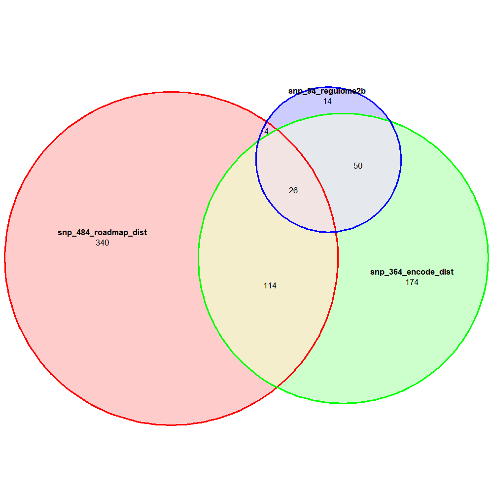
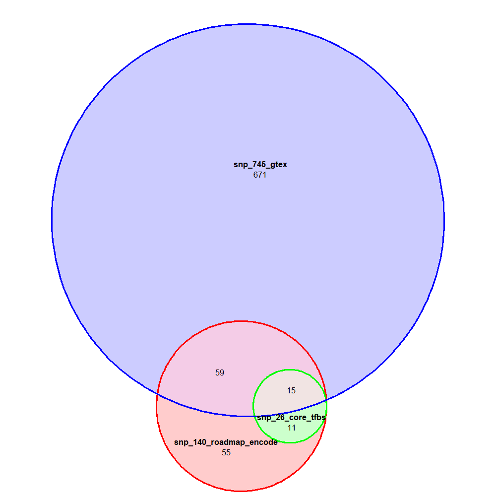
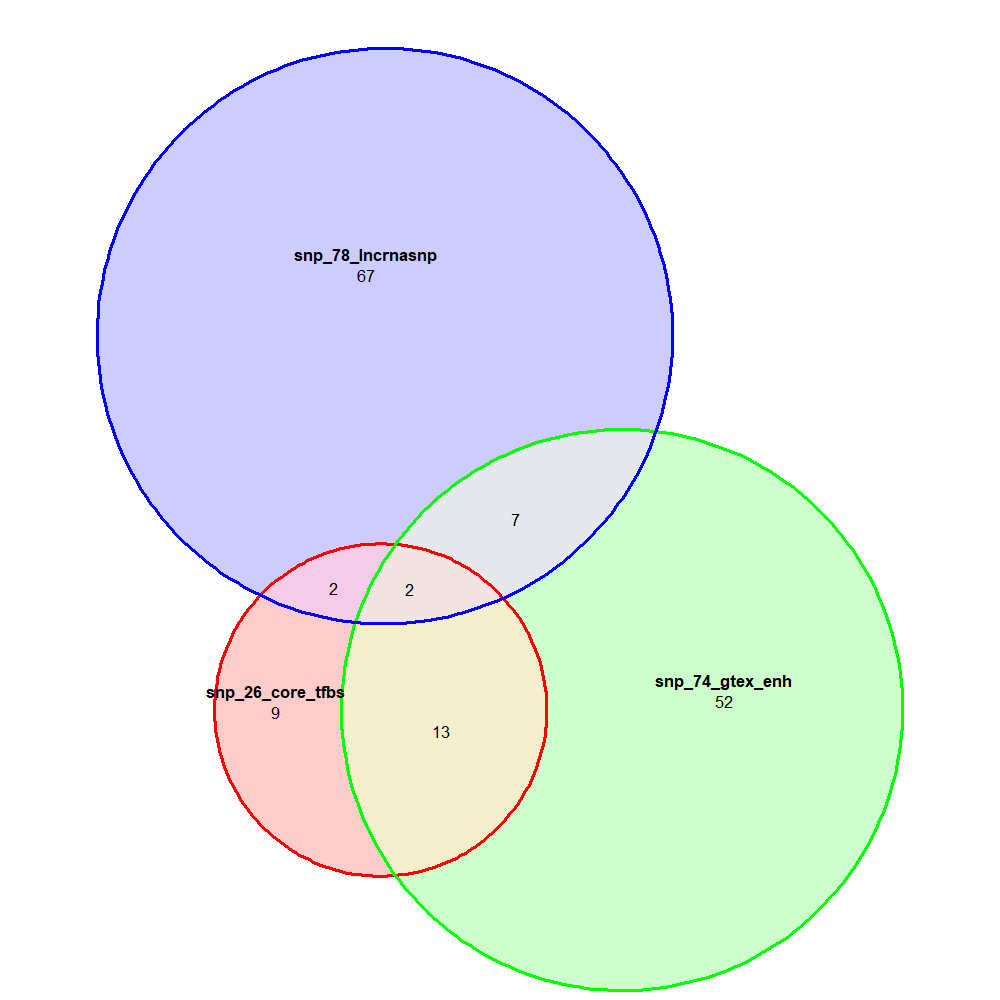

# Disease SNP prioritization

This is an protocol for prioritization of SNPs associated certain phenotype/disease. Here is a study for prioritization of SNPs associated with Type 1 diabetes. You can follow the below analysis steps.


## 1. Seed SNPs preparation for type 1 diabetes (T1D)

### > gwas.r

To download **GWAS Catalog data** (MacArthur et al, 2017, Nucleic Acids Research, pmid 27899670), you can [search certain disease](https://www.ebi.ac.uk/gwas/). In this study, we downloaded [SNP-sets for type 1 diabetes](https://www.ebi.ac.uk/gwas/efotraits/EFO_0001359). Then you can run R code file for filtering the GWAS Catalog data as below `CMD` command line:

- Bellow functions are run under the windows or linux command console environment.
- Instead of `[ ]`, you have to put the arguments `file path` or `value` by the options.
- Usage: `Rscript gwas.r [GWAS_file_path] [p-value_criteria]`

```cmd
Rscript src/gwas.r ^
	db/GWAS_EFO0001359.tsv ^
	5e-08
```

### > ldlink_dn.py and ldink_filt.r

To download **LDlink data** (version 3.3.0 12/24/2018) (Machiela et al, 2015, Bioinformatics, pmid 26139635), you can run `T1D_ldlink.py` as below `CMD` command line:

- To run the code, you need list of SNP RS IDs of dbSNP database as txt file
- Usage: `python ldlink.py [SNP_file_path.txt]`

```CMD
python src/ldlink_dn.py ^
	data/gwas_5e-08_129.tsv
```

> ...
> 129/129 = rs11580078
>   status_code = 200
>   line number = 950
>   file saved = db/ldlink/rs11580078.tsv
>
> Download process completed.
> Job time= 00:42:49

To filter the LDlink data by statistical criteria, both r<sup>2</sup> >0.6 and D'=1, you can run `T1D_ldlink.r` as below `CMD` command line:

- Usage: `Rscript ldlink.r [SNP_file_path.txt] [LDlink_data_folder_path] [LDlink_filter_option]`
- The `LDlink_filter_option` is a mandatory. Choose one of the following option numbers.
  1. `r2>0.6 or Dprime=1`
  2. `r2>0.6`
  3. `Dprime=1`
  4. `r2>0.6 and Dprime=1`

```CMD
Rscript ldlink_filt.r ^
	data/gwas_5e-08_129.tsv db/ldlink 4
```

> Input SNP list number = 129
>
> Error in read.table(as.character(snptb[i, 2]), header = T) :
>     more columns than column names
> In addition: Warning message:
> In read.table(as.character(snptb[i, 2]), header = T) :
>     incomplete final line found by readTableHeader on 'db/ldlink/rs75793288.tsv'
> NULL
> Filtering option, r2 > 0.6 and Dprime = 1 was chosen.
> ::Excluded no rsid elements = 10
>
> 1/3. Numbers of SNPs
> SNP Tier1 = 129
> SNP Tier2 = 1688
> SNP seed  = 1817
>
> 2/3. Generation of a result TSV file
> File write: data/seedSNP_1817_ldlink.tsv
>
> 3/3. Generation of a result BED file
> Table, rows= 1817 cols= 4
> File write: data/seedSNP_1817.bed
> Job done for 6.1 sec

* `data/seedSNP_5245_ldlink.tsv` -> **Supplementary Table 1** and **Supplementary Table 2**

### Q1. Generation of private SNP list (rsids) to BED file format?

To use bedtools later, you have to prepare SNP list as [bed format](https://genome.ucsc.edu/FAQ/FAQformat.html). If you have simple dbSNP rsid list, you can run `src/biomart_snp.r` for generate bed file. But you should check `NA` values and fill it manually.

* Usage: `Rscript src/biomart_snp.r [rsid_list_file_path]`

```CMD
Rscript src/biomart_snp.r ^
	data/seedSNP_5245_biomart.txt
```

> Input contents, rows= 5244 cols= 1
> Table, rows= 10280 cols= 4
>
> Job done for 12.7 sec

**[IMPORTANT]** Before you move to next step, we make sure that your `seedSNP_#.bed` file has no NA values.


## 2. Roadmap data download and filter

The [RoadMAP project](https://egg2.wustl.edu/roadmap/web_portal/imputed.html) provides epigenome annotations such as [12-mark/127-reference epigenome/25-state Imputation Based Chromatin State Model](https://egg2.wustl.edu/roadmap/data/byFileType/chromhmmSegmentations/ChmmModels/imputed12marks/jointModel/final/) by using ChromHMM algorithm (Ernst and Kellis, 2012, Nature Methods, pmid 22373907). We downloaded the 127 files by their [cell types](https://github.com/mdozmorov/genomerunner_web/wiki/Roadmap-cell-types) (e.g., `E001_25_imputed12marks_dense.bed.gz` and etc) using R code (`T1D_roadmap.r`). And then we filtered the data by [annotation code](https://egg2.wustl.edu/roadmap/web_portal/imputed.html) (see db/[roadmap] ) including 13_EnhA1, 14_EnhA2, 15_EnhAF, 16_EnhW1, 17_EnhW2, 18_EnhAc.

To download RoadMap data, you need to install `AnnotationHub` and `rtracklayer` in `BiocManaer` as below R code:

```R
if (!requireNamespace("BiocManager", quietly = TRUE))
    install.packages("BiocManager")
BiocManager::install("AnnotationHub", version = "3.8")
BiocManager::install("rtracklayer", version = "3.8")
```

### > roadmap_dn.r

To download **RoadMap data**, you can run `roadmap_dn.r` as below `CMD` command line:

- The 127 cell type-specific RoadMap BED files will download at `db/roadmap` folder
- This process takes about ~30 min that depends on your download speed.

```CMD
Rscript src/roadmap_dn.r
```

### > roadmap_filt.r

To filter the RoadMap data by **Enhancers**, you can run `roadmap_filt.r` as below `CMD` command line:

- The result file would be saved as `data/roadmap_enh.bed`
- This process takes ~3 min that depends on your computer processor speed.

```CMD
Rscript src/roadmap_filt.r
```

### Q2. If you have memory problem..

When running the `roadmap_filt.r` function, it stop with not enough memory error, You can use `roadmap_filt_dtr.r` function for limited memory usage (~3.8 GB).

```CMD
Rscript src/roadmap_filt_dtr.r
```

### $ bedtools merge/ bedtools closest

To avoid multiple count of enhancers as well as to reduce file size and to achieve faster process, merge RoadMap enhancer information using a `BASH` tool `bedtools`. Here is the `BASH` pipeline for `bedtools sort` and `bedtools merge`. Then, to identify T1D SNPs occupied in RoadMap enhancers, you can use `BASH` tool `bedtools intersect` as below code:

- Compressed file size of `roadmap_enh.bed.gz` is >139 MB.
- Compressed file size of `roadmap_enh_merge.bed.gz` is about 3.7 MB.
- Removing NA values, `data/seedSNP_1817_bm.bed` file is updated version from the `data/seedSNP_1817.bed` file.

```SHELL
bedtools sort -i db/roadmap_enh.bed | bedtools merge -i stdin -c 1 -o count > db/roadmap_enh_merge.bed
bedtools sort -i data/seedSNP_1817_bm.bed | bedtools closest -d -a stdin -b db/roadmap_enh_merge.bed > data/roadmap_dist.tsv
```

### > src/bedtools_closest.r

To prioritize RoadMap enhancer occupied SNPs, you can run `src/bedtools_closestroadmap.r` as below `CMD` command line:

- `data/roadmap_dist_df.tsv` file is obtained that is for enhancer annotated file .
- `data/snp_484_roadmap_dist.bed` file is obtained that is for `BED` format file for USCS browser.
- Usage: `Rscript src/bedtools_closest.r [bedtools_closest_result_file_path] [double_line_result]`

```CMD
Rscript src/bedtools_closest.r ^
	data/roadmap_dist.tsv ^
	False
```

> Row number = 1817
>   Enhancer occupied by SNPs = 188
>   SNPs in RoadMap enhancers = 484
>
> File write: data/roadmap_dist_df.tsv
> File write: data/snp_484_roadmap_dist.bed
>
> Job done for 0.1 sec

* `data/roadmap_dist_df.tsv` -> **Supplementary Table 2**

### Q3. How about just use not merged roadmap_enh.bed file?

Instead of merge file, when you use original `db/roadmap_enh.bed` file, you can find a lot of duplicated enhancers regions.

```SHELL
bedtools sort -i db/roadmap_enh.bed | bedtools closest -d -a data/seedSNP_1817.bed -b stdin > data/roadmap_dist2.tsv
```


## 3. ENCODE ChIP-seq data download and filter

The **ENCODE ChIP-seq** for regulatory transcription factor binding site (Reg-TFBS) cluster data can downloaded <u>wgEncodeRegTfbsClusteredV3</u> data from [UCSC FTP](http://hgdownload.cse.ucsc.edu/goldenpath/hg19/encodeDCC/wgEncodeRegTfbsClustered/) (68 MB) or [bioconductor `data("wgEncodeTfbsV3")`](https://www.bioconductor.org/packages/devel/bioc/vignettes/ChIPpeakAnno/inst/doc/ChIPpeakAnno.html). Here, we assume having downloaded UCSC FTP file `wgEncodeRegTfbsClusteredV3.bed.gz` (81 MB).

```CMD
Rsciprt src/encode_dn.r
```

> Directory generated: db/encode/
> trying URL 'http://hgdownload.cse.ucsc.edu/goldenpath/hg19/encodeDCC/wgEncodeRegTfbsClustered/wgEncodeRegTfbsClusteredV3.bed.gz'
> Content type 'application/x-gzip' length 84986946 bytes (81.0 MB)
>
> downloaded 81.0 MB
>
> db/encode/wgEncodeRegTfbsClusteredV3.bed.gz
>
> Job done for 1.8 min

### $ bedtools merge | bedtools closest

To identify TFBS occupied SNPs, you can use `bedtools merge` and `bedtools closest` as following code:

- Merging the ENCODE TFBS data give you benefits such as avoiding multiple count of enhancers as well as reducing file size and achieving faster process

```SHELL
bedtools merge -i db/wgEncodeRegTfbsClusteredV3.bed.gz -c 1 -o count > db/encode_tfbs_merge.bed
bedtools sort -i data/seedSNP_1817_bm.bed | bedtools closest -d -a stdin -b db/encode_tfbs_merge.bed > data/encode_dist.tsv
```

### > src/bedtools_closest.r

To prioritize ENCODE Reg-TFBS occupied SNPs, you can run `src/bedtools_closestroadmap.r` as below `CMD` command line:

- `data/roadmap_dist_df.tsv` file is obtained that is for enhancer annotated file .
- `data/snp_enh_484.bed` file is obtained that is for `BED` format file for USCS browser.
- Usage: `Rscript src/bedtools_closest_roadmap.r [bedtools_closest_result_file_path] [double_line_result]`

```CMD
Rscript src/bedtools_closest.r ^
	data/encode_dist.tsv ^
	False
```

> Row number = 1817
>   Enhancer occupied by SNPs = 232
>   SNPs in RoadMap enhancers = 364
>
> File write: data/encode_dist_df.tsv
> File write: data/snp_364_encode_dist.bed
>
> Job done for 0.1 sec

* `data/encode_dist_df.tsv` -> **Supplementary Table 2**


## 4. Regulome DB data download and filter

The [**RegulomeDB**](http://www.regulomedb.org/index) provides [category scores for SNPs by evidences](http://www.regulomedb.org/help) (see `Regulome score.txt`), including eQTL, TF binding, matched TF motif, matched DNase Footprint, and DNase peak. In this study, we stringently filtered and used high-score (`≥ 2b`) SNPs for our study. Before you start, you can download the files from [Regulome DB download page](http://www.regulomedb.org/downloads). To make this process faster, you can convert the downloaded files to RDS format.

- `RegulomeDB.dbSNP132.Category1.txt.gz` (2 MB)
- `RegulomeDB.dbSNP132.Category2.txt.gz` (39.3 MB)
- Or you can download total dataset: `RegulomeDB.dbSNP141.txt.gz` (2.8 GB)

```CMD
Rscript src/regulome_dn.r
```

> In dir.create(file.path(dir)) : 'db\regulome' already exists
> trying URL 'http://www.regulomedb.org/downloads/RegulomeDB.dbSNP132.Category1.txt.gz'
> Content type 'application/gzip' length 2096454 bytes (2.0 MB)
>
> downloaded 2.0 MB
>
> trying URL 'http://www.regulomedb.org/downloads/RegulomeDB.dbSNP132.Category2.txt.gz'
> Content type 'application/gzip' length 41253483 bytes (39.3 MB)
>
> downloaded 39.3 MB
>
> Job process: 52.2 sec
> File write: db/regulome/RegulomeDB.dbSNP132.Category1.txt.gz.rds
> File write: db/regulome/RegulomeDB.dbSNP132.Category2.txt.gz.rds
> Job done for 1.2 min

Here we converted the download files to RDS format files to achieve fast loading speed. Use the RegulomeDB RDS files, you can filter and analyze the dataset by using `regulome.r` as following command line:

```CMD
Rscript src/regulome.r ^
	data/seedSNP_1817_bm.bed ^
	db/RegulomeDB.dbSNP132.Category1.txt.rds ^
	db/RegulomeDB.dbSNP132.Category2.txt.rds
```

> Input SNPs number = 1817
> Input regulome files = 2
>
> Read input file 1: db/RegulomeDB.dbSNP132.Category1.txt.rds
> Table row = 39432, col = 5
> Job process: 0.2 sec
>
> Read input file 2: db/RegulomeDB.dbSNP132.Category2.txt.rds
> Table row = 407796, col = 5
> Job process: 5 sec
>
> Regulome score >=2b, SNPs = 430528
> Functional motifs (2b-1f_only) = 395823
>   Regulome >=2b SNPs = 94
>   SNPs with functional motifs (1f_only-2b) = 45
>
> File write: data/regulome_94.tsv
> File write: data/snp_94_regulome2b.bed
> Job done for 5.3 sec

The result files are save at `data/` folder:

- `data/regulome_94.tsv` -> **Supplementary Table 2**
- `data/snp_94_regulome2b.bed`


### Venn analysis to identify core SNPs

Summary for SNPs with RoadMap annotation, ENCODE ChIP-seq, and RegulomeDB. This R code for Venn analysis uses **Bioconductor** `limma` R package. The installation of the `limma` package as below:

```R
if (!requireNamespace("BiocManager", quietly = TRUE))
    install.packages("BiocManager")
BiocManager::install("limma", version = "3.8")
```

To prioritize the SNPs, you can run `venn.r` as below `CMD` command line with these files:

- `data/snp_484_roadmap_dist.bed`
- `data/snp_1253_encode_dist.bed`
- `data/snp_301_regulome2b.bed`

### > venn.r

```CMD
Rscript src/venn.r ^
	data/snp_484_roadmap_dist.bed ^
	data/snp_364_encode_dist.bed ^
	data/snp_94_regulome2b.bed
```

> package 'eulerr' was built under R version 3.6.2
>   snp_484_roadmap_dist
>   snp_364_encode_dist
>   snp_94_regulome2b
> 
>File write: data/venn.tsv
> 
> ** Euler fitting... done.
> 
>Figure draw: fig/euler_snp_484_roadmap_dist_snp_364_encode_dist.png
> File write: data/snp_26_core.bed

The result files are generated as below:

- `venn_tfbs.tsv`: binary SNP overlap table
- `snp_79_core.bed`

The result figure is generated as below:



## 5. GTEx eQTL data download and filter

The [Genotype-Tissue Expression (GTEx)](https://gtexportal.org/home/) project is a public resource to study tissue-specific gene expression and their regulation by SNPs. GTEx version 7 includes 11,688 samples, 53 tissues and 714 donors. You can download [GTEx eQTL data](https://gtexportal.org/home/datasets) `GTEx_Analysis_v7_eQTL.tar.gz` (915 MB) and filter by statistical criteria `p < 3e-04`. The `GTEx_Analysis_v7_eQTL.tar.gz` compressed file includes:

- 48 files with `db/GTEx_Analysis_v7_eQTL/*.egenes.txt` extensions
- 48 files with `db/GTEx_Analysis_v7_eQTL/*.signif_variant_gene_pairs.txt` extensions

And we need SNP annotations to achieve Rsid for GTEx ids.

- `db/GTEx_Analysis_2016-01-15_v7_WholeGenomeSeq_635Ind_PASS_AB02_GQ20_HETX_MISS15_PLINKQC.lookup_table.txt.gz` (440 MB)
- [Nominal p-values](https://gtexportal.org/home/documentationPage) from GTEx data were generated for each variant-gene pair by testing the alternative hypothesis that the slope of a linear regression model between genotype and expression deviates from 0.

### > gtex_dn.r [and] gtex_filt.r

```CMD
Rscript src/gtex_dn.r
```

> (1/2) Download eQTL data
> trying URL 'https://storage.googleapis.com/gtex_analysis_v7/single_tissue_eqtl_data/GTEx_Analysis_v7_eQTL.tar.gz'
> Content type 'application/x-tar' length 959746583 bytes (915.3 MB)
>
> downloaded 915.3 MB
>
> File write: db/gtex_files.txt
>
> (2/2) Download SNPid annotation file
> trying URL 'https://storage.googleapis.com/gtex_analysis_v7/reference/GTEx_Analysis_2016-01-15_v7_WholeGenomeSeq_635Ind_PASS_AB02_GQ20_HETX_MISS15_PLINKQC.lookup_table.txt.gz'
> Content type 'application/gzip' length 461926948 bytes (440.5 MB)
>
> downloaded 440.5 MB
>
> Job done for 1.2 min

`> 50 min` The downloaded files were converted to RDS files.

```CMD
Rscript src/gtex_rds.r
```

>  - Loading GTEx BED files
>  - File reading...
>     (1/48) Adipose_Subcutaneous
>     ...
>   (48/48) Whole_Blood
> NULL
>  gte.df.pval_nominal
>  Min.   :0.000e+00
>  1st Qu.:0.000e+00
>  Median :1.111e-07
>  Mean   :7.398e-06
>  3rd Qu.:5.219e-06
>  Max.   :8.005e-04
>  - GTEx table, rows= 36781356 cols= 13
>  - BED file read complete. Job process: 9.3 min
>  - Loading annotation file - Annotation file read complete. Job process: 35.5 min
>  - Annotation file, rows= 40738696 cols= 7
>  - GTEx annotation, rows= 36781356 cols= 9
>
> Job process: 50.7 min
>
>  - Saving as RDS file..
>
> Job process: 52 min
>
> Job done for 52 min

To filter the GTEx data by p <5e-08, I executed following code:

```CMD
Rscript src/gtex_filt.r ^
	5e-08
```

> p-value threshold = 5e-08
>
> (1/3) Loading GTEx RDS file
>  - GTEx table, rows= 36781356 cols= 9
>  - BED file read complete. Job process: 53.3 sec
>
> (2/3) Filtering by nominal p-value
>  gte.sig.pval_nominal
>  Min.   :0.000e+00
>  1st Qu.:0.000e+00
>  Median :3.120e-12
>  Mean   :3.897e-09
>  3rd Qu.:1.429e-09
>  Max.   :5.000e-08
>  - GTEx significant, rows= 17113536 cols= 9
>  - Job process: 1.1 min
>
> File write: db/gtex_signif.tsv
> Job done for 3.8 min

The result file size are huge and the process takes long time (~50 min)

- `gtex_signif_5e-8.tsv.rds` (322 MB)
- This file was compressed by `zip` as three separated <100 MB files.
  1. `gtex_signif_5e-8.tsv.zip`
  2. `gtex_signif_5e-8.tsv.z01`
  3. `gtex_signif_5e-8.tsv.gz.z02`

To identify T1D SNPs 

```CMD
Rscript src/gtex.r ^
	data/seedSNP_1817_bm.bed ^
	db/gtex_signif_5e-8.tsv.rds
```

> Input SNPs number = 1,817
>
> (1/3) Loading GTEx significant file
>   gtex_signif_5e-8.tsv.rds: rows= 17,113,536 cols= 9
>   Job process: 23.9 sec
>
> (2/3) eQTL SNP filteration
>   Overlapped table, rows= 29,785 cols= 9
>   eQTL SNPs = 745
>   Associated genes = 159
> File write: data/gtex_5e-08_745.tsv
>
> (3/3) eQTL SNP BED file generation
>   GTEx SNP BED, rows= 745 cols= 4
>   eQTL SNPs = 745
> File write: data/snp_745_gtex.bed
>
> Job done for 26.7 sec

The result files of criteria 5e-08 are here:

- `gtex_5e-08_745.tsv` -> **Supplementary Table 3**
- `snp_745_gtex.bed`

### Roadmap & ENCODE

Preparing a file: `data_gwas/snp_140_roadmap_encode.bed`

```Bash
bedtools sort -i data/snp_484_roadmap_dist.bed | bedtools closest -d -a stdin -b db/encode_tfbs_merge.bed > data/roadmap_encode.tsv
```

```CMD
Rscript src/bedtools_closest.r ^
	data/roadmap_encode_dist.tsv ^
	False
```

### Venn analysis and overlap SNPs

To prioritize the eQTL SNPs among the 26 high-probability causal enhancer SNPs, you can run `venn.r` as below `CMD` command line with these files:

- `data/snp_140_roadmap_encode.bed` - Enhancer occupied SNP list **<- manually generated**
- `data/snp_26_core_tfbs.bed` - High-probability causal enhancer SNP list
- `data/snp_745_gtex.bed` - eQTL SNP list

### > venn.r

```CMD
Rscript src/venn.r ^
	data/snp_140_roadmap_encode.bed ^
	data/snp_26_core_tfbs.bed ^
	data/snp_745_gtex.bed
```

> package 'eulerr' was built under R version 3.6.2
>   snp_140_roadmap_encode
>   snp_26_core_tfbs
>   snp_745_gtex
>
> File write: data/venn.tsv
>
> ** Euler fitting... done.
>
> Figure draw: fig/euler_snp_140_roadmap_encode_snp_26_core_tfbs.png
> File write: data/snp_15_core.bed
> Job done for 0.2 sec

The result files are generated as below:

- `venn.tsv` > `venn_gtex.tsv`: binary SNP overlap table
- `snp_15_core.bed` > `snp_15_core_gtex.bed`: SNP `BED` format file

The result figure is generated as below:




## 5-1. Nearest gene approach

### downloading Ensembl gene location data

To identify nearest genes from the eQTL SNPs, firstly you need to download gene location data from Ensembl database biomart (version=Grch37). 

```CMD
Rscript src/biomart_gene.r
```

>  - Ensembl table, rows= 63677 cols= 5
>  - File write: db/ensembl_gene_ann.tsv
>
>  - Filter result, rows= 57736 cols= 5
>  - File write: db/ensembl_gene.bed
>
> Job done for 17.1 sec

### $ bedtools closest

To identify nearest genes from the eQTL SNPs, you can use `bedtools merge` and `bedtools closest` as following `BASH` codes:

```SHELL
bedtools sort -i db/ensembl_gene.bed | bedtools closest -d -a data/seedSNP_5245_bm.bed -b stdin > data/seedSNP_nearest.tsv
```

```SHELL
bedtools sort -i db/ensembl_gene.bed | bedtools closest -d -a data/snp_2676_gtex.bed -b stdin > data/gtex_nearest.tsv
```

### > src/bedtools_closest.r

To prioritize RoadMap enhancer occupied SNPs, you can run `src/bedtools_closestroadmap.r` as below `CMD` command line:

- Usage: `Rscript src/bedtools_closest_gtex.r [bedtools_closest_result_file_path]`

```CMD
Rscript src/bedtools_closest_gtex.r data/seedSNP_nearest.tsv
```
> Row number = 2114
> Input SNPs = 1817
> Nearest genes = 175
>
> File write: data/seedSNP_nearest_df.tsv
>
> Job done for 0.1 sec


```CMD
Rscript src/bedtools_closest_gtex.r data/gtex_nearest.tsv
```

> Row number = 2909
> Input SNPs = 2676
> Nearest genes = 308
>
> File write: data/gtex_nearest_df.tsv
>
> Job done for 0.2 sec

* `data/gtex_nearest_df.tsv` -> **Supplementary Table 4**

### > src/gtex_overlap.r

To identify the eQTL SNPs occupied on TFBS binding enhancers, you can run `src/gtex_overlap.r` as below `CMD` command line:

```CMD
Rscript src/gtex_overlap.r ^
	data/snp_140_roadmap_encode.bed ^
	data/gtex_5e-08_745.tsv ^
	data/gtex_nearest_df.tsv
```

> 1. Read files..
>     data/snp_140_roadmap_encode.bed, rows= 140 cols= 4
>     data/gtex_5e-08_745.tsv, rows= 29785 cols= 9
>     data/gtex_nearest_df.tsv, rows= 788 cols= 7
>
>   SNPs= 745 Genes= 159 (Nearest= 44)
>
> 2. Overlap the two files..
>     TFBS overlap, rows= 5301 cols= 10
>    SNPs= 74 Genes= 94 (Nearest= 25)
> 
>File write: data/snp_74_gtex_enh.bed
> Job done for 0.3 sec


## 6. lncRNASNP2 data download and filter

Human SNPs located in long non-coding RNAs (lncRNAs) are archived in [**lncRNASNP2 database**](http://bioinfo.life.hust.edu.cn/lncRNASNP#!/). You can download these data at the [download page](http://bioinfo.life.hust.edu.cn/lncRNASNP#!/download):

- `lncRNASNP2_snplist.txt.gz` - **SNP list** includes the list of human SNPs in lncRNASNP database.
- `lncrnas.txt.gz` - **lncRNA list** includes the list of human lncRNAs in lncRNASNP database.
- `lncrna-diseases_experiment.txt.gz` - **Experimental validated lncRNA-associated diseases** includes all experiment validated lncRNA-associated diseases.
- `Rscript lncrnasnp.r [SNP_BED_file_path] [lncRNAsnp2_SNP_list_file_path] [lncRNAsnp2_lncRNA_list_file_path] [lncRNAsnp2_diseases_list_file_path]`

```CMD
Rscript lncrnasnp_dn.r
```

> 1: package 'data.table' was built under R version 3.5.2
>
> 2: package 'GenomeInfoDb' was built under R version 3.5.2
>
> trying URL 'http://bioinfo.life.hust.edu.cn/static/lncRNASNP2/downloads/snps_mod.txt'
>
> Content type 'text/plain; charset=GBK' length 477785336 bytes (455.7 MB)
>
> downloaded 455.7 MB
>
> trying URL 'http://bioinfo.life.hust.edu.cn/static/lncRNASNP2/downloads/lncrnas.txt'
>
> Content type 'text/plain; charset=GBK' length 7005411 bytes (6.7 MB)
>
> downloaded 6.7 MB
>
> trying URL 'http://bioinfo.life.hust.edu.cn/static/lncRNASNP2/downloads/lncRNA_associated_disease_experiment.txt'
>
> Content type 'text/plain; charset=GBK' length 31542 bytes (30 KB)
>
> downloaded 30 KB
>
> Job process: 1.4 min
>
> File write: db/lncRNASNP2_snplist.txt.rds
>
> File write: db/lncrnas.txt.rds
>
> File write: db/lncrna-diseases_experiment.txt.rds
>
> Job done for 2.2 min

To identify lncRNA overlapped longevity SNPs:

```CMD
Rscript src/lncrnasnp.r ^
	data/seedSNP_1817_bm.bed ^
	db/lncRNASNP2_snplist.txt.rds ^
	db/lncrnas.txt.rds db/lncrna-diseases_experiment.txt.rds
```

> 1. Read files..
>     data/seedSNP_1817_bm.bed...                   Job process: 0 sec
>     db/lncRNASNP2_snplist.txt.rds...              Job process: 13.3 sec
>     db/lncrnas.txt.rds...                         Job process: 13.5 sec
>     db/lncrna-diseases_experiment.txt.rds...      Job process: 13.5 sec
> 
> 
> | path                                  |     nrow | ncol |
> | :------------------------------------ | -------: | ---: |
> | data/seedSNP_1817_bm.bed              |     1817 |    4 |
> | db/lncRNASNP2_snplist.txt.rds         | 10205295 |    2 |
> | db/lncrnas.txt.rds                    |   141271 |    4 |
> | db/lncrna-diseases_experiment.txt.rds |      753 |    3 |
>  Job process: 13.6 sec
> 2. Overlapping lncRNA to my SNP list and binding annotation..
> 
> | lncRNA | SNPs |
> | -----: | ---: |
> |     42 |   78 |
> 
>  File write: data/snp_78_lncrnasnp.bed
> 
>3. Annotating SNPs in lncRNAs
>     File write: data/lncrnasnp_78.tsv
>
> Job done for 17.1 sec

- `data/snp_78_lncrnasnp.bed` - 78 SNPs `BED` file
- `data/lncrnasnp_78.tsv` -> **Supplementary Table 5**

### > venn.r

```CMD
Rscript src/venn.r ^
	data/snp_26_core_tfbs.bed ^
	data/snp_74_gtex_enh.bed ^
	data/snp_78_lncrnasnp.bed
```

> package 'eulerr' was built under R version 3.6.2
>   snp_26_core_tfbs
>   snp_74_gtex_enh
>   snp_78_lncrnasnp
>
> File write: data/venn.tsv
>
> ** Euler fitting... done.
>
> Figure draw: fig/euler_snp_26_core_tfbs_snp_74_gtex_enh.png
> File write: data/snp_2_core.bed
> Job done for 0.2 sec

- `venn.tsv` -> `venn_lncrnasnp.tsv`: binary SNP overlap table
- `vennCounts.tsv` -> `vennCounts_lncrnasnp.tsv`: overlapped SNP numbers
- `snp_2_core.bed` -> `snp_2_core_lncrnasnp.bed`: SNP `BED` format file



### > Venn.r; Summary Table

```cmd
Rscript src/venn.r ^
	data/seedSNP_1817_bm.bed ^
	data/snp_745_gtex.bed ^
	data/snp_364_encode_dist.bed ^
	data/snp_484_roadmap_dist.bed ^
	data/snp_94_regulome2b.bed ^
	data/snp_78_lncrnasnp.bed
```

> package 'eulerr' was built under R version 3.6.2
>   seedSNP_1817_bm
>   snp_745_gtex
>   snp_364_encode_dist
>   snp_484_roadmap_dist
>   snp_94_regulome2b
>   snp_78_lncrnasnp
>
> [Message] Can't plot Venn diagram for more than 5 sets.
>
> File write: data/venn.tsv
>
> [Message] If you need snp_#_core.bed file, please input three groups.
> Job done for 0.1 sec

- `venn.tsv` -> `summary.tsv` : Summary file for this analysis.


# *Enrichment analysis


## Roadmap ChromHMM data

### Run permutation test

To calculate enrichment, run below command function at `bash`.

* T1D GWAS SNP file: `data/seedSNP_1817_bm.bed`
* Roadmap 127 BED files at `db/roadmap_bed` directory

```shell
Rscript src/enrich.r --permu \
    --gwassnp data/seedSNP_1817_bm.bed \
    --chrstatus db/roadmap_bed \
    --dbsource roadmap_bed \
    --permn 100 \
    --out enrich
Rscript src/enrich.r --permu \
    --gwassnp data/seedSNP_1817_bm.bed \
    --chrstatus db/roadmap_bed \
    --dbsource roadmap_bed \
    --permn 10 \
    --out enrich
```

> ** Run perm_test function in enrich.r **
>
> * Gwas snp = [1] 1817    4
> * 127 files were found from db/roadmap_bed:
>   1 Load E001: roadmap_bed = [1] 933206      4
>
>   Run permTest: 25 annotations, [.........................] done. Job process: 1.3 min
>   2 Load E002: roadmap_bed = [1] 837982      4
>
>   ...
>
>   Run permTest: 25 annotations, [.........................] done. Job process: 1.4 min
>   126 Load E128: roadmap_bed = [1] 835642      4
>
>   Run permTest: 25 annotations, [.........................] done. Job process: 1.4 min
>   127 Load E129: roadmap_bed = [1] 912567      4
>
>   Run permTest: 25 annotations, [.........................] done. Job process: 1.4 min
>
> * Write file: enrich/roadmap_bed-seedSNP_1817_bm-zscore.tsv
> * Write file: enrich/roadmap_bed-seedSNP_1817_bm-pval.tsv
> There were 50 or more warnings (use warnings() to see the first 50)
>
> Job done: 2021-01-07 21:12:50 for 2.8 hr

```bash
Rscript src/enrich.r --permu \
    --gwassnp data/seedSNP_1817_bm.bed \
    --chrstatus db/roadmap_bed \
    --dbsource roadmap_bed \
    --permn 1000 \
    --out enrich
```

> ** Run perm_test function in enrich.r **
>
> * Gwas snp = [1] 1817    4
> * 127 files were found from db/roadmap_bed.
>
> 1 Load E001: roadmap_bed = [1] 933206      4
>   Run permTest: 25 annotations, [.........................] done. Job process: 8.3 min
> 2 Load E002: roadmap_bed = [1] 837982      4
>   Run permTest: 25 annotations, [.........................] done. Job process: 8.3 min
> ...
> 126 Load E128: roadmap_bed = [1] 835642      4
>   Run permTest: 25 annotations, [.........................] done. Job process: 7.7 min
> 127 Load E129: roadmap_bed = [1] 912567      4
>   Run permTest: 25 annotations, [.........................] done. Job process: 9.6 min
>
> * Write file: enrich/roadmap_bed-seedSNP_1817_bm-zscore.tsv
> * Write file: enrich/roadmap_bed-seedSNP_1817_bm-pval.tsv
> There were 50 or more warnings (use warnings() to see the first 50)
>
> Job done: 2021-01-08 15:59:44 for 17.1 hr


Run this function for 129 seed gwas SNPs.

```bash
Rscript src/enrich.r --permu \
    --gwassnp data/gwas_5e-08_129_hg19.bed \
    --chrstatus db/roadmap_bed \
    --dbsource roadmap_bed \
    --permn 100 \
    --out enrich
```

> ** Run perm_test function in enrich.r **
>
> * Gwas snp = [1] 129   4
> * 127 files were found from db/roadmap_bed.
>
> 1 Load E001: roadmap_bed = [1] 933206      4
>   Run permTest: 25 annotations, [.........................] done. Job process: 55.6 sec
> 2 Load E002: roadmap_bed = [1] 837982      4
>   Run permTest: 25 annotations, [.........................] done. Job process: 53.7 sec
> ...
> 126 Load E128: roadmap_bed = [1] 835642      4
>   Run permTest: 25 annotations, [.........................] done. Job process: 57.2 sec
> 127 Load E129: roadmap_bed = [1] 912567      4
>   Run permTest: 25 annotations, [.........................] done. Job process: 58.2 sec
>
> * Write file: enrich/roadmap_bed-gwas_5e-08_129_hg19-zscore.tsv
> * Write file: enrich/roadmap_bed-gwas_5e-08_129_hg19-pval.tsv
> There were 50 or more warnings (use warnings() to see the first 50)
>
> Job done: 2021-01-08 06:00:11 for 1.9 hr

```bash
Rscript src/enrich.r --permu \
    --gwassnp data/gwas_5e-08_129_hg19.bed \
    --chrstatus db/roadmap_bed \
    --dbsource roadmap_bed \
    --permn 1000 \
    --out enrich
```

> 


Run this function for 484 roadmap enhancer SNPs.

```bash
Rscript src/enrich.r --permu \
    --gwassnp data/snp_484_roadmap_dist.bed \
    --chrstatus db/roadmap_bed \
    --dbsource roadmap_bed \
    --permn 100 \
    --out enrich
```


### Draw heatmap

To draw heatmap by using the z-scores calculated from the permutation test, run below command function at `bash`.

```bash
Rscript src/enrich.r --heatmap \
    --pmdata roadmap_bed-seedSNP_1817_bm-permn100-zscore.tsv \
    --out enrich
```

> ** Run draw_heatmap function in enrich.r **
>
> * Permutation result table = [1]  25 128
> * Prepare table... done
>
> Save as enrich/roadmap_bed-seedSNP_1817_bm-zscore2.png
>
> Job done: 2021-01-08 21:04:41 for 2.4 sec

```bash
Rscript src/enrich.r --heatmap \
    --pmdata roadmap_bed-seedSNP_1817_bm-permn1000-zscore.tsv \
    --meta db/roadmap_meta.tsv \
    --out enrich \
    --annot BLOOD,PANCREAS,THYMUS \
    --fileext png
```

> ** Run draw_heatmap function in enrich.r **
>
> * Permutation result table = [1]  25 128
> * Prepare table... done
>
> Save as enrich/roadmap_bed-seedSNP_1817_bm-zscore.png
>
> Job done: 2021-01-08 21:05:43 for 1.6 sec

```bash
Rscript src/enrich.r --heatmap \
    --pmdata roadmap_bed-gwas_5e-08_129_hg19-permn100-zscore.tsv \
    --meta db/roadmap_meta.tsv \
    --out enrich \
    --annot BLOOD,PANCREAS,THYMUS \
    --fileext png
```

> ** Run draw_heatmap function in enrich.r **
>
> * Permutation result table = [1]  25 128
> * Prepare table... done
>
> Save as enrich/roadmap_bed-gwas_5e-08_129_hg19-zscore.png
>
> Job done: 2021-01-08 21:06:40 for 1.7 sec


## ENCODE Analysis Data

Data browse and download: http://genome.ucsc.edu/ENCODE/downloads.html

* [wgEncodeRegTfbsClusteredWithCellsV3.bed](http://hgdownload.soe.ucsc.edu/goldenPath/hg19/encodeDCC/wgEncodeRegTfbsClustered/wgEncodeRegTfbsClusteredWithCellsV3.bed.gz): TFBS clusters together with input cell sources (BED 5+1 format: standard 5 fields of BED followed by comma-separated list of cell types)

```bash
Rscript src/enrich.r --splittfbs \
    --tfbs db/wgEncodeRegTfbsClusteredWithCellsV3.bed \
    --out db/tfbs_cell
```


# *Obsolete codes

## Prepare Roadmap enhancers

SNP residing on regulatory elements in Roadmap data: Run below command function at `bash`

Run a bash file `db/roadmap_dist.sh`:

```bash
sortBed -i db/roadmap/E001_25_imputed12marks_dense.bed | closestBed -d -a data/seedSNP_1817_bm.bed -b stdin > db/roadmap_dist/E001_snp_dist.tsv
...
sortBed -i db/roadmap/E129_25_imputed12marks_dense.bed | closestBed -d -a data/seedSNP_1817_bm.bed -b stdin > db/roadmap_dist/E129_snp_dist.tsv
```

```bash
bash roadmap_dist.sh
```

* Result files are stored at `db/roadmap_dist` folder.


Filtering by dist 0 and merge results from cell types

```bash
Rscript src/enrich.r --roadmap --dir db/roadmap_dist --out db
```

> ** Run roadmap_merge function in enrich.r **
>
> Read roadmap dist files... 127.. [1] 230759      7
> Write TSV file: dbroadmap_merge.tsv
>
> Job done: 2021-01-06 22:12:10 for 3.1 sec