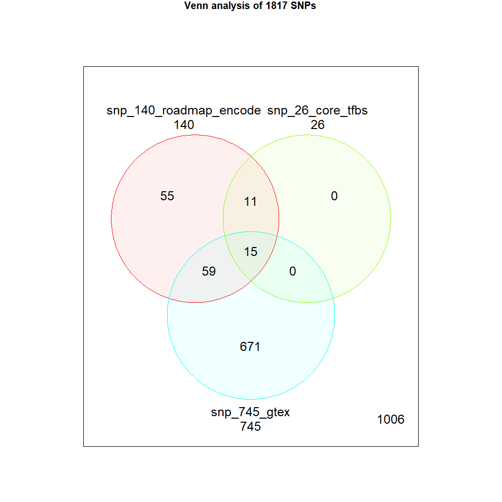

# Disease SNP prioritization

This is an protocol for prioritization of SNPs associated certain phenotype/disease. Here is a study for prioritization of SNPs associated with Type 1 diabetes. You can follow the below analysis steps.


## 1. Seed SNPs preparation for type 1 diabetes (T1D)

### gwas.r

To download **GWAS Catalog data**, you can [search certain disease](https://www.ebi.ac.uk/gwas/). In this study, we downloaded [SNP-sets for type 1 diabetes](https://www.ebi.ac.uk/gwas/efotraits/EFO_0001359). Then you can run R code file for filtering the GWAS Catalog data as below command line:

- Instead of `[ ]`, you have to put the arguments `file path` or `value` by the options.

```cmd
Rscript gwas.r [GWAS_file_path] [p-value_criteria]
```

### ldlink.py/ ldlink.r

To download **LDlink data**, you can run `T1D_ldlink.py` as below `CMD` command line:

- To run the code, you need list of SNP RS IDs of dbSNP database as txt file

```CMD
python ldlink.py [SNP_file_path.txt]
```

To Filter the LDlink data, you can run `T1D_ldlink.r` as below `CMD` command line:

```CMD
Rscript ldlink.r [SNP_file_path.txt] [LDlink_data_folder_path]
```

### Q1. How to make private SNP list BED file?

To use bedtools later, you have to prepare SNP list as [bed format](https://genome.ucsc.edu/FAQ/FAQformat.html). If you have simple dbSNP rsid list, you can run `src/snp_biomart.r` for generate bed file. But you should check `NA` values and fill it manually.

```CMD
Rscript src/snp_bed.r
```


## 2. RoadMap data download and filter

The [RoadMAP project](https://egg2.wustl.edu/roadmap/web_portal/imputed.html) provides epigenome annotations such as [12-mark/127-reference epigenome/25-state Imputation Based Chromatin State Model](https://egg2.wustl.edu/roadmap/data/byFileType/chromhmmSegmentations/ChmmModels/imputed12marks/jointModel/final/). We downloaded the 127 files by their [cell types](https://github.com/mdozmorov/genomerunner_web/wiki/Roadmap-cell-types) (e.g., `E001_25_imputed12marks_hg38lift_dense.bed.gz` and etc) using R code (`T1D_roadmap.r`). And then we filtered the data by [annotation code](https://egg2.wustl.edu/roadmap/web_portal/imputed.html) (see db/[roadmap] ) including 13_EnhA1, 14_EnhA2, 15_EnhAF, 16_EnhW1, 17_EnhW2, 18_EnhAc.

To download RoadMap data, you need to install `AnnotationHub` and `rtracklayer` in `BiocManaer` as below R code:

```R
if (!requireNamespace("BiocManager", quietly = TRUE))
    install.packages("BiocManager")
BiocManager::install("AnnotationHub", version = "3.8")
BiocManager::install("rtracklayer", version = "3.8")
```

### > roadmap_dn.r

To download **RoadMap data**, you can run `roadmap_dn.r` as below `CMD` command line:

- The RoadMap BED files will download at `db/roadmap` folder
- This process takes about ~10 min that depends on your download speed.

```CMD
Rscript roadmap_dn.r
```

### > roadmap_filt.r

To filter the RoadMap data by **Enhancers**, you can run `roadmap_filt.r` as below `CMD` command line:

- The result file would be saved as `data/roadmap_enh.bed`
- This process takes >12 min that depends on your hard drive read speed.

```CMD
Rscript roadmap_filt.r
```

### $ bedtools merge/ bedtools closest

To avoid multiple count of enhancers as well as to reduce file size and to achieve faster process, merge RoadMap enhancer information using a `BASH` tool `bedtools`. Here is the `BASH` pipeline for `bedtools sort` and `bedtools merge`. Then, to identify T1D SNPs occupied in RoadMap enhancers, you can use `BASH` tool `bedtools intersect` as below code:

- Compressed file size of `roadmap_enh.bed.gz` is >139 MB.
- Compressed file size of `roadmap_enh_merer.bed.gz` is about 3.7 MB.

```SHELL
bedtools sort -i db/roadmap_enh.bed | bedtools merge -i stdin -c 1 -o count > db/roadmap_enh_merge.bed
bedtools closest -d -a data/seedSNP_1817.bed -b db/roadmap_enh_merge.bed > data/roadmap_dist.tsv
```

### > src/bedtools_closest.r

To prioritize RoadMap enhancer occupied SNPs, you can run `src/bedtools_closestroadmap.r` as below `CMD` command line:

- `data/roadmap_dist_df.tsv` file is obtained that is for enhancer annotated file .
- `data/snp_484_roadmap_dist.bed` file is obtained that is for `BED` format file for USCS browser.

```CMD
::Rscript src/bedtools_closest_roadmap.r [bedtools_closest_result_file_path]
Rscript src/bedtools_closest_roadmap.r data/roadmap_dist.tsv
```

### Q2. How about just use not merged roadmap_enh.bed file?

Instead of merge file, when you use original `db/roadmap_enh.bed` file, you can find a lot of duplicated enhancers regions.

```SHELL
bedtools sort -i db/roadmap_enh.bed | bedtools closest -d -a data/seedSNP_1817.bed -b stdin > data/roadmap_dist2.tsv
```


## 3. ENCODE ChIP-seq data download and filter

The **ENCODE ChIP-seq** for regulatory transcription factor binding site (Reg-TFBS) cluster data can downloaded <u>wgEncodeRegTfbsClusteredV3</u> data from [UCSC FTP](http://hgdownload.cse.ucsc.edu/goldenpath/hg19/encodeDCC/wgEncodeRegTfbsClustered/) (68 MB) or [bioconductor `data("wgEncodeTfbsV3")`](https://www.bioconductor.org/packages/devel/bioc/vignettes/ChIPpeakAnno/inst/doc/ChIPpeakAnno.html). Here, we assume having downloaded UCSC FTP file `wgEncodeRegTfbsClusteredV3.bed.gz` (81 MB).

### $ bedtools merge | bedtools closest

To identify TFBS occupied SNPs, you can use `bedtools merge` and `bedtools closest` as following code:

- Merging the ENCODE TFBS data give you benefits such as avoiding multiple count of enhancers as well as reducing file size and achieving faster process

```SHELL
bedtools merge -i db/wgEncodeRegTfbsClusteredV3.bed.gz -c 1 -o count > db/encode_tfbs_merge.bed
bedtools closest -d -a data/seedSNP_1817.bed -b db/encode_tfbs_merge.bed > data/encode_dist.tsv
```

### > src/bedtools_closest.r

To prioritize ENCODE Reg-TFBS occupied SNPs, you can run `src/bedtools_closestroadmap.r` as below `CMD` command line:

- `data/roadmap_dist_df.tsv` file is obtained that is for enhancer annotated file .
- `data/snp_enh_484.bed` file is obtained that is for `BED` format file for USCS browser.

```CMD
::Rscript src/bedtools_closest_roadmap.r [bedtools_closest_result_file_path]
Rscript src/bedtools_closest_roadmap.r data/encode_dist.tsv
```


## 4. Regulome DB data download and filter

The [Regulome DB](http://www.regulomedb.org/downloads) provides [category scores for SNPs by evidences](http://www.regulomedb.org/help) (see `Regulome score.txt`), including eQTL, TF binding, matched TF motif, matched DNase Footprint, and DNase peak. In this study, we stringently filtered and used high-score (`≥ 2b`) SNPs for our study.

- `RegulomeDB.dbSNP132.Category1.txt.gz` (2 MB)
- `RegulomeDB.dbSNP132.Category2.txt.gz` (39.3 MB)
- Or you can download total dataset: `RegulomeDB.dbSNP141.txt.gz` (2.8 GB)

```CMD
Rscript regulome.r data/seedSNP_1817_ldlink.tsv db/RegulomeDB.dbSNP132.Category1.txt.gz db/RegulomeDB.dbSNP132.Category2.txt.gz
```

The result files are save at `data/` folder:

- `data/regulome_#.tsv`
- `data/snp_#_regulome2b.bed`


### Venn analysis to identify core SNPs

Summary for SNPs with RoadMap annotation, ENCODE ChIP-seq, and RegulomeDB. This R code for Venn analysis uses **Bioconductor** `limma` R package. The installation of the `limma` package as below:

```R
if (!requireNamespace("BiocManager", quietly = TRUE))
    install.packages("BiocManager")
BiocManager::install("limma", version = "3.8")
```

To prioritize the SNPs, you can run `venn.r` as below `CMD` command line with these files:

- `data/seedSNP_1817.bed`
- `data/snp_484_roadmap_dist.bed`
- `data/snp_364_encode_dist.bed`
- `data/snp_94_regulome2b.bed`

### > venn.r

```CMD
Rscript venn.r data/seedSNP_1817.bed data/snp_484_roadmap_dist.bed data/snp_364_encode_dist.bed data/snp_94_regulome2b.bed
```

The result files are generated as below:

- `venn_tfbs.tsv`: binary SNP overlap table
- `vennCounts_tfbs.tsv`: overlapped SNP numbers
- `snp_#_core.bed`

The result figure is generated as below:


## 5. GTEx eQTL data download and filter

The [Genotype-Tissue Expression (GTEx)](https://gtexportal.org/home/) project is a public resource to study tissue-specific gene expression and their regulation by SNPs. GTEx version 7 includes 11,688 samples, 53 tissues and 714 donors. You can download [GTEx eQTL data](https://gtexportal.org/home/datasets) `GTEx_Analysis_v7_eQTL.tar.gz` (915 MB) and filter by statistical criteria `p < 3e-04`. The `GTEx_Analysis_v7_eQTL.tar.gz` compressed file includes:

- 48 files with `db/GTEx_Analysis_v7_eQTL/*.egenes.txt` extensions
- 48 files with `db/GTEx_Analysis_v7_eQTL/*.signif_variant_gene_pairs.txt` extensions

And we need SNP annotations to achieve Rsid for GTEx ids.

- `db/GTEx_Analysis_2016-01-15_v7_WholeGenomeSeq_635Ind_PASS_AB02_GQ20_HETX_MISS15_PLINKQC.lookup_table.txt.gz` (440 MB)
- [Nominal p-values](https://gtexportal.org/home/documentationPage) from GTEx data were generated for each variant-gene pair by testing the alternative hypothesis that the slope of a linear regression model between genotype and expression deviates from 0.

### > gtex_dn.r | gtex_filt.r

```CMD
Rscript gtex_dn.r
Rscript gtex_filt.r 5e-08
```

The result file size are huge and the process takes long time (~50 min)

- `gtex_signif.tsv.gz` (268 MB) > `gtex_signif_5e-8.tsv.gz`
- This file was compressed by `zip` as three separated <100 MB files.
- `gtex_signif_5e-8.tsv.gz.zip`, `gtex_signif_5e-8.tsv.gz.z01`, and `gtex_signif_5e-8.tsv.gz.z02`

To identify T1D SNPs 

```CMD
> Rscript gtex.r data/seedSNP_1817.bed db/gtex_signif_5e-8.tsv.gz

Input SNPs number = 1,817

(1/3) Loading GTEx significant file
  - gtex_signif_5e-8.tsv.gz: rows= 17,113,536 cols= 9
  - Job process: 2.7 min

(2/3) eQTL SNP annotation
  - Overlapped table, rows= 29,785 cols= 9
  - eQTL SNPs = 745
  - Associated genes = 159
  >> File write: data/gtex_5e-08_745.tsv

(3/3) eQTL SNP BED file generation
  - GTEx SNP BED, rows= 745 cols= 4
  - eQTL SNPs = 745
  >> File write: data/snp_745_gtex.bed
```

The result files of criteria 5e-08 are here:

- `gtex_5e-08_745.tsv`
- `snp_745_gtex.bed`

### Venn analysis and overlap SNPs

To prioritize the eQTL SNPs among the 26 high-probability causal enhancer SNPs, you can run `venn.r` as below `CMD` command line with these files:

- `data/seedSNP_1817.bed` - Total T1D SNP list
- `data/snp_140_roadmap_encode.bed` - Enhancer occupied SNP list
- `data/snp_26_core.bed` - High-probability causal enhancer SNP list
- `data/snp_745_gtex.bed` - eQTL SNP list

### > venn.r

```CMD
Rscript venn.r data/seedSNP_1817.bed data/snp_140_roadmap_encode.bed data/snp_26_core.bed data/snp_745_gtex.bed
```

The result files are generated as below:

- `venn.tsv`->`venn_gtex.tsv`: binary SNP overlap table
- `vennCounts.tsv`->`vennCounts_gtex.tsv`: overlapped SNP numbers
- `snp_#_core.bed`

The result figure is generated as below:



### > src/gtex_overlap.r

To identify the eQTL SNPs occupied on enhancers, you can run `src/gtex_overlap.r` as below `CMD` command line:

```R
> Rscript src/gtex_overlap.r

(1/2) Read files..
 - data/snp_140_roadmap_encode.bed, rows= 140 cols= 4
 - data/gtex_5e-08_745.tsv, rows= 29785 cols= 9
 - data/gtex_5e-08_745.tsv, SNPs= 745 Genes= 159

(2/2) Overlap these two files..
 - TFBS overlap, rows= 5301 cols= 9
 - TFBS overlap, SNPs= 74 Genes= 94

 - Whole_Blood, rows= 202 cols= 9
 - Whole_Blood, SNPs= 52 Genes= 29

>> File write: data/snp_74_gtex_enh.bed
```

### downloading Ensembl gene location data

To identify nearest genes from the eQTL SNPs, firstly you need to download gene location data from Ensembl database biomart (version=Grch37). 

```CMD
> Rscript src/biomart_gene.r

Ensembl table, rows= 63677 cols= 5
File write: db/ensembl_gene_ann.tsv

Filter result, rows= 57736 cols= 5
File write: db/ensembl_gene.bed
```

### $ bedtools closest

To identify nearest genes from the eQTL SNPs, you can use `bedtools merge` and `bedtools closest` as following code:

```SHELL
$ bedtools sort -i db/ensembl_gene.bed | bedtools closest -d -a data/seedSNP_1817.bed -b stdin > data/seedSNP_nearest.tsv
```

```SHELL
$ bedtools sort -i db/ensembl_gene.bed | bedtools closest -d -a data/snp_745_gtex.bed -b stdin > data/gtex_nearest.tsv
```

### > src/bedtools_closest.r

To prioritize RoadMap enhancer occupied SNPs, you can run `src/bedtools_closestroadmap.r` as below `CMD` command line:

```CMD
::Rscript src/bedtools_closest_gtex.r [bedtools_closest_result_file_path]
> Rscript src/bedtools_closest_gtex.r data/seedSNP_nearest.tsv

Row number = 2114
T1D SNPs = 1817
Nearest genes = 175
>> File write: data/seedSNP_nearest_df.tsv
```

```CMD
> Rscript src/bedtools_closest_gtex.r data/gtex_nearest.tsv

Row number = 788
T1D SNPs = 745
Nearest genes = 113
>> File write: data/gtex_nearest_df.tsv
```

### > src/gtex_overlap.r

To identify the eQTL SNPs occupied on TFBS binding enhancers, you can run `src/gtex_overlap.r` as below `CMD` command line:

```CMD
> Rscript src/gtex_overlap.r

(1/2) Read files..
  - data/snp_140_roadmap_encode.bed, rows= 140 cols= 4
  - data/gtex_5e-08_745.tsv, rows= 29785 cols= 9
  - data/gtex_nearest_df.tsv, rows= 788 cols= 7
 >> SNPs= 745 Genes= 159 (Nearest= 44)

(2/2) Overlap these two files..
  - TFBS overlap, rows= 5301 cols= 10
 >> SNPs= 74 Genes= 94 (Nearest= 25)

  - Whole_Blood, rows= 202 cols= 10
 >> SNPs= 52 Genes= 29 (Nearest= 8)

>> File write: data/snp_74_gtex_enh.bed
```


## 6. lncRNASNP2 data download and filter

Human SNPs located in long non-coding RNAs (lncRNAs) are archived in [**lncRNASNP2 database**](http://bioinfo.life.hust.edu.cn/lncRNASNP#!/). You can download these data at the [download page](http://bioinfo.life.hust.edu.cn/lncRNASNP#!/download):

- `lncRNASNP2_snplist.txt.gz` - **SNP list** includes the list of human SNPs in lncRNASNP database.
- `lncrnas.txt.gz` - **lncRNA list** includes the list of human lncRNAs in lncRNASNP database.
- `lncrna-diseases_experiment.txt.gz` - **Experimental validated lncRNA-associated diseases** includes all experiment validated lncRNA-associated diseases.

```CMD
: Rscript lncrnasnp.r [SNP_BED_file_path] [lncRNAsnp2_SNP_list_file_path] [lncRNAsnp2_lncRNA_list_file_path] [lncRNAsnp2_diseases_list_file_path]
Rscript lncrnasnp.r data/seedSNP_1817.bed db/lncRNASNP2_snplist.txt.gz db/lncrnas.txt.gz db/lncrna-diseases_experiment.txt.gz
```

| path                         | nrow     | ncol |
| :--------------------------- | :------- | :--- |
| data/seedSNP_1817.bed        | 1817     | 4    |
| db/lncRNASNP2_snplist.txt.gz | 10205295 | 2    |
| db/lncrnas.txt.gz            | 141271   | 4    |
| NA                           | 753      | 3    |


## 7. Monte Carlo permutation for random SNP set

To calculate SNP backgrounds for this pipeline, we generate 10,000 random control SNP sets from [dbSNP database (version 151, GRCh37p13)](ftp://ftp.ncbi.nih.gov/snp/organisms/human_9606_b151_GRCh37p13/BED/). To calculate their distributions, you can run `*.r` as below `CMD` command line:

```CMD

```


